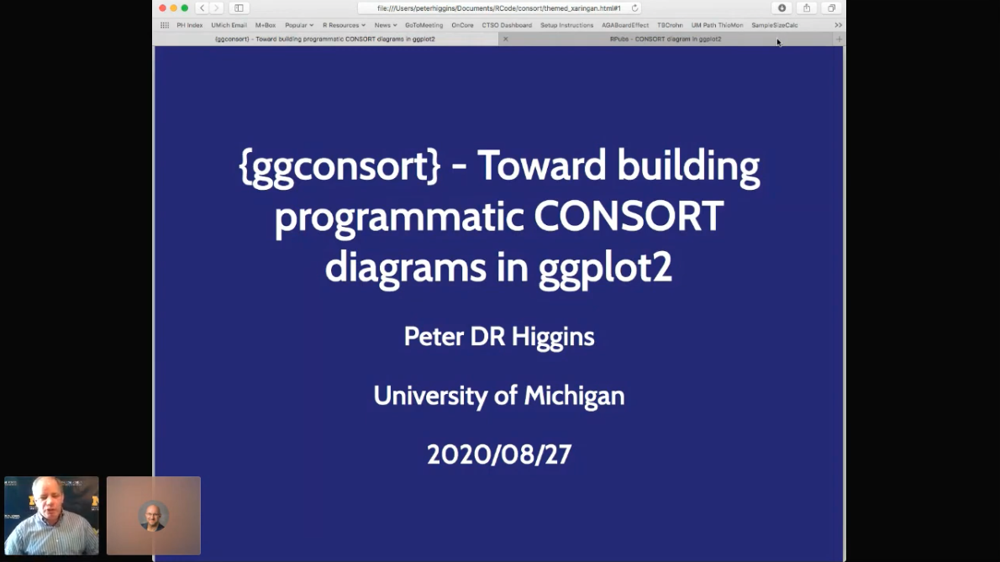

```{r xaringan-themer, include=FALSE, warning=FALSE}
library(xaringanthemer)

style_duo_accent(
  primary_color = "#4e796f",
  secondary_color = "#794e58",
  colors = list(
    offwhite = "#f5f0e4",
    green = "#4e796f",
    burgundy = "#794e58",
    purple = "#5A4E79",
    lightgreen = "#6E794E"
  ),
  extra_fonts = list(google_font("Raleway"))
)
```

class: title-slide-custom

## ggconsort

### Travis Gerke, ScD <br> .purple[Director of Data Science] <br> .offwhite[PCCTC]

<!--
Photo by <a href="https://unsplash.com/@timmossholder?utm_source=unsplash&utm_medium=referral&utm_content=creditCopyText">Tim Mossholder</a> on <a href="https://unsplash.com/s/photos/selection?utm_source=unsplash&utm_medium=referral&utm_content=creditCopyText">Unsplash</a>
-->

---
### Flashback: R/Medicine 2020



---
### What are CONSORT diagrams?
.h2-subtitle[★ Courtesy of Peter Higgins, R/Medicine 2020]

<br>

* A CONSORT diagram shows the flow of participants from screening to analysis, showing counts and reasons for exclusion along the way

* Expected by most medical journals for reporting clinical trials (and, increasingly, observational studies)

<!-- image source https://www.nejm.org/doi/full/10.1056/nejmoa071255 -->

.h-center.w-35[

]

---
### CONSORT diagrams are artisanal products
.h2-subtitle[★ Courtesy of Peter Higgins, R/Medicine 2020]

<br>
* Most CONSORTs are built from [templates](http://www.consort-statement.org/consort-statement/flow-diagram) in Word/Powerpoint/Illustrator

.h-center.w-50[

]

---
### Prior work

* R implementations _not_ native to .green[ggplot2]

  * .green[DiagrammeR/Graphviz]: [Wong](https://dannyjnwong.github.io/STROBE-CONSORT-Diagrams-in-R/), [Higgins/Gerber, 2020](https://github.com/higgi13425/ggconsort/pull/1), [Köhler 2017](https://scriptsandstatistics.wordpress.com/author/koehlern/)
  * .green[tikz]: [Gerke lab](https://github.com/GerkeLab/consoRt)
  * .green[JS]: [Gerke](https://github.com/tgerke/flowcharter)

* Challenges: non-.green[ggplot] syntax; sometimes _too much_ automation

.h-center.w-40[

]

---
### A fresh look / the goodness of the R community

.css-typing[
Hi Peter,

I'd like to take a pretty different approach to {ggconsort}.

Are you willing to transfer the name? 

Travis
]

---
### A fresh look / the goodness of the R community

Hi Peter,

I'd like to take a pretty different approach to {ggconsort}.

Are you willing to transfer the name? 

Travis

<br>
<hr>
<br>

.css-typing-2[
Hi Travis,

Feel free to use the name, hex sticker, and anything else useful.

https://github.com/higgi13425/ggconsort/

Peter
]


---


```{css, echo = FALSE}
.title-slide-custom {
  position: relative;
  z-index: 1;
}
.title-slide-custom h2 {
  font-size: 3em;
  position: absolute;
  color: var(--offwhite);
  bottom: 39%;
  right: 20%;
}
.title-slide-custom h3 {
  font-size: .75em;
  text-align: right;
  color: var(--green);
  position: absolute;
  bottom: 2%;
  right: 2%;
}
.title-slide-custom::before {    
      content: "";
      background-image: url('images/tim-mossholder-zdV9ngtM0Sw-unsplash.jpg');
      background-size: cover;
      position: absolute;
      top: 0px;
      right: 0px;
      bottom: 0px;
      left: 0px;
      opacity: 0.7;
      z-index: -1;
}
.title-slide-custom .remark-slide-number {
  display: none;
}
.h2-subtitle {
  color: var(--burgundy);
  position: absolute;
  top: 15%;
}
.purple-bg {
  background-color: var(--purple);
}
.h-center {
  margin: 0 auto;
}
.w-90 {
  width: 90%;
}
.w-50 {
  width: 50%;
}
.w-40 {
  width: 40%;
}
.w-35 {
  width: 35%;
}
.small-rule{
  font-size: 1em;
  font-weight: bold;
  color: var(--green);
}

.highlight-last-item > ul > li, 
.highlight-last-item > ol > li {
  opacity: 0.5;
  color: var(--purple);
}
.highlight-last-item > ul > li:last-of-type,
.highlight-last-item > ol > li:last-of-type {
  opacity: 1;
  font-weight: bold;
}

.remark-visible .css-typing p {
  opacity: 0;
  border-right: .15em solid orange;
  white-space: nowrap;
  overflow: hidden;
  -webkit-animation-fill-mode: forwards;
  animation-fill-mode: forwards
}
.remark-visible .css-typing p:nth-child(1) {
  width: 100px;
  -webkit-animation: type .5s steps(9,end);
  animation: type .5s steps(9,end);
  -webkit-animation-fill-mode: forwards;
  animation-fill-mode: forwards
}
.remark-visible .css-typing p:nth-child(2) {
  width: 550px;
  -webkit-animation: type 2s steps(31,end);
  animation: type 2s steps(31,end);
  -webkit-animation-fill-mode: forwards;
  animation-fill-mode: forwards;
  -webkit-animation-delay: 1.5s;
  animation-delay: 1.5s
}
.remark-visible .css-typing p:nth-child(3) {
  width: 375px;
  -webkit-animation: type 1s steps(20,end);
  animation: type 1s steps(20,end);
  -webkit-animation-fill-mode: forwards;
  animation-fill-mode: forwards;
  -webkit-animation-delay: 5s;
  animation-delay: 5s
}
.remark-visible .css-typing p:nth-child(4) {
  width: 60px;
  -webkit-animation: type .5s steps(7,end);
  animation: type .5s steps(7,end);
  -webkit-animation-fill-mode: forwards;
  animation-fill-mode: forwards;
  -webkit-animation-delay: 7s;
  animation-delay: 7s
}

.remark-visible .css-typing-2 p {
  opacity: 0;
  border-right: .15em solid orange;
  white-space: nowrap;
  overflow: hidden;
  -webkit-animation-fill-mode: forwards;
  animation-fill-mode: forwards
}
.remark-visible .css-typing-2 p:nth-child(1) {
  width: 100px;
  -webkit-animation: type .5s steps(9,end);
  animation: type .5s steps(9,end);
  -webkit-animation-fill-mode: forwards;
  animation-fill-mode: forwards
}
.remark-visible .css-typing-2 p:nth-child(2) {
  width: 600px;
  -webkit-animation: type 2s steps(31,end);
  animation: type 2s steps(31,end);
  -webkit-animation-fill-mode: forwards;
  animation-fill-mode: forwards;
  -webkit-animation-delay: 1.5s;
  animation-delay: 1.5s
}
.remark-visible .css-typing-2 p:nth-child(3) {
  width: 410px;
  -webkit-animation: type 1s steps(20,end);
  animation: type 1s steps(20,end);
  -webkit-animation-fill-mode: forwards;
  animation-fill-mode: forwards;
  -webkit-animation-delay: 5s;
  animation-delay: 5s
}
.remark-visible .css-typing-2 p:nth-child(4) {
  width: 60px;
  -webkit-animation: type .5s steps(7,end);
  animation: type .5s steps(7,end);
  -webkit-animation-fill-mode: forwards;
  animation-fill-mode: forwards;
  -webkit-animation-delay: 7s;
  animation-delay: 7s
}
@keyframes type {
  0% {
    width: 0
  }
  1% {
    opacity: 1
  }
  99.9% {
    border-right: .15em solid orange
  }
  100% {
    opacity: 1;
    border: none
  }
}
@-webkit-keyframes type {
  0% {
    width: 0
  }
  1% {
    opacity: 1
  }
  99.9% {
    border-right: .15em solid orange
  }
  100% {
    opacity: 1;
    border: none
  }
}
@keyframes blink {
  50% {
    border-color: transparent
  }
}
@-webkit-keyframes blink {
  50% {
    border-color: tranparent
  }
}
```
